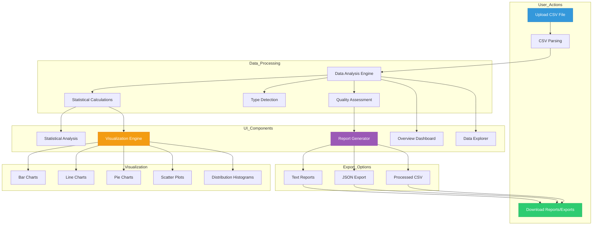

# CSV Analyzer


**A powerful browser-based CSV analysis tool with zero server dependencies**

[](https://opensource.org/licenses/MIT)
[](https://github.com/Bros-AI/CSVAnalyzer/stargazers)
[](https://github.com/Bros-AI/CSVAnalyzer/issues)
[](https://www.bros.ai)

## 📊 Description

CSV Analyzer is a comprehensive, browser-based data analysis tool developed by Bros.AI that empowers users to gain insights from CSV data while maintaining complete privacy. Unlike most online data tools, CSV Analyzer processes everything locally in your browser, ensuring your data never leaves your computer.

With an elegant and intuitive interface, it makes professional data analysis accessible to everyone - from business analysts to researchers, educators to data scientists. Simply upload a CSV file and instantly access powerful visualization, statistics, and reporting features, all through your web browser with zero installation required.

### Why CSV Analyzer?

- **100% Client-Side**: Your data never leaves your browser
- **Zero Installation**: Works in any modern browser
- **Comprehensive Analysis**: Get detailed statistics and visualizations instantly
- **User-Friendly**: Intuitive interface requires no technical expertise
- **Free & Open Source**: Use, modify and contribute freely

## ✨ Key Features

- **Instant Statistical Analysis**: Automatically calculate key statistics (min, max, mean, median, standard deviation)
- **Interactive Data Explorer**: Browse, search, and page through your data effortlessly
- **Data Quality Assessment**: Identify missing values, outliers, and quality issues
- **Interactive Visualizations**: Create customizable charts (bar, line, pie, scatter plots)
- **Distribution Analysis**: Understand data distribution with histograms and frequency charts
- **Comprehensive Reporting**: Generate detailed analysis reports with actionable insights
- **Multiple Export Options**: Export as text reports, processed CSV, or JSON
- **Responsive Design**: Works seamlessly across desktop, tablet, and mobile devices

## 📈 Application Architecture



## 🔧 Technology Stack

| Component | Technology |
|-----------|------------|
| **Frontend Framework** | Pure HTML5, CSS3, JavaScript (ES6+) |
| **CSV Parsing** | [PapaParse](https://www.papaparse.com/) |
| **Data Visualization** | [Chart.js](https://www.chartjs.org/) |
| **User Interface** | Custom responsive design |
| **Deployment** | GitHub Pages |

## 📋 Feature Comparison

| Feature | CSV Analyzer | Basic Spreadsheets | Pro Analytics Tools |
|---------|:------------:|:------------------:|:-------------------:|
| **Browser-based** | ✅ | ✅ | ❌ |
| **No installation required** | ✅ | ❌/✅ | ❌ |
| **Data stays local** | ✅ | ❌ | ❌ |
| **Statistical analysis** | ✅ | ⚠️ Limited | ✅ |
| **Data visualization** | ✅ | ⚠️ Limited | ✅ |
| **Quality assessment** | ✅ | ❌ | ✅ |
| **Free to use** | ✅ | ⚠️ Some | ❌ |
| **Open source** | ✅ | ❌ | ❌ |
| **Export formats** | Multiple | Limited | Multiple |

## 🚀 Quick Start

1. Visit [https://bros-ai.github.io/CSVAnalyzer](https://github.com/Bros-AI/CSVAnalyzer) or host the files on your own server
2. Click "Upload CSV File" to select your data file
3. Explore the automatically generated analysis in the various tabs:
   - **Overview**: Quick summary statistics and file information
   - **Data Explorer**: Browse through your data with search and filtering
   - **Statistics**: Detailed statistical analysis of all columns
   - **Visualize**: Create custom charts and visualizations
   - **Report**: Generate comprehensive analysis reports

## 💾 Installation

### Local Development

1. Clone the repository:
   ```bash
   git clone https://github.com/Bros-AI/CSVAnalyzer.git
   ```

2. Open the project directory:
   ```bash
   cd CSVAnalyzer
   ```

3. Open `index.html` in your browser, or serve with a local server:
   ```bash
   # Using Python
   python -m http.server 8000
   
   # Or using Node.js http-server
   npx http-server
   ```

### Self-Hosting

Upload the three files (`index.html`, `styles.css`, and `script.js`) to any web hosting service. No server-side processing, database, or special configuration is needed.

## 📊 CSV Data Format Support

CSV Analyzer supports:

- Standard CSV files with comma separators
- Files with header rows
- CSV files with or without quotation marks
- Various data types (numeric, text, dates)
- Files up to several MB in size (browser-dependent)

## 🤝 Contributing

Contributions are welcome! To contribute:

1. Fork the repository
2. Create a feature branch: `git checkout -b feature/amazing-feature`
3. Commit your changes: `git commit -m 'Add some amazing feature'`
4. Push to the branch: `git push origin feature/amazing-feature`
5. Open a Pull Request

## 📜 License

This project is licensed under the MIT License - see the [LICENSE](LICENSE) file for details.

## 🧑‍💼 About the Developer

CSV Analyzer is developed by Gauthier Bros, founder of [Bros.AI](https://www.bros.ai), a company specializing in accessible AI and data science tools.

- Website: [www.bros.ai](https://www.bros.ai)
- GitHub: [github.com/Bros-AI](https://github.com/Bros-AI)
- Contact: hello@bros.ai

## 🙏 Acknowledgements

- [PapaParse](https://www.papaparse.com/) for CSV parsing
- [Chart.js](https://www.chartjs.org/) for visualization capabilities
- The open-source community for inspiration
